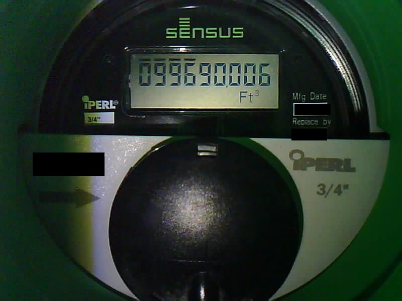

# Sensus iPerl Water Meter for Home Assistant

ESPHome + an ESP32‑CAM are used to read a Sensus iPerl water meter and expose the total volume to Home Assistant as a `sensor.water_meter_usage` entity.  
ImageMagick and `ssocr` handle the OCR, while Home Assistant automations periodically capture and process snapshots.

The files in this repo are meant as a working example / starting point that you can adapt to your own installation.

## Features

- Uses a cheap ESP32‑CAM to photograph the iPerl 7-digit LCD screen
- 3D‑printed mount for consistent alignment and lighting
- Home Assistant automation to:
  - Turn on the ESP32‑CAM flashlight
  - Capture a snapshot every few minutes
  - Crop and preprocess the digits region with ImageMagick
  - Run `ssocr` to extract a 9‑digit reading
- Command‑line sensor that:
  - Converts the raw digits to ft³ (cubic feet)
  - Enforces sanity checks (no big jumps, no going backwards)
  - Exposes the result as `sensor.water_meter_usage` (total_increasing)

## Hardware

- Sensus iPerl residential water meter (I have the 3/4" model)
- ESP32‑CAM module with Micro‑USB or serial programmer
- Stable 5V power supply for ESP32‑CAM

## 3D‑Printed Parts

The camera must be mounted to read the digits on the meter. These models provide a good starting point:

- Sensus iPerl adapter:  
  [Sensus iPerl Water Meter Adapter for jomjol's AI-on-the-edge](https://www.printables.com/model/611686-sensus-iperl-water-meter-adapter-for-jomjols-ai-on)
- Original AI-on-the-edge mount:  
  [water meter / Wasserzähler - AI-on-the-edge](https://www.thingiverse.com/thing:4573481)

You will need to fine‑tune camera distance, focus, and rotation for your particular installation by removing the glue from the ESP-CAM lens and adjusting until the image is sharp enough.

## How It Works (High Level)

1. ESPHome exposes the ESP32‑CAM as:
   - A camera entity: `camera.water_meter_cam_ov2640`
   - A flashlight / LED entity: `light.water_meter_cam_flashlight`
2. A Home Assistant automation (`automation.yaml`) runs every few minutes:
   - Turns on the flashlight
   - Waits for the image to stabilize
   - Refreshes the camera entity and saves a snapshot to `/media/water_meter/snapshot.jpg`
   - Calls a shell command that:
     - Uses ImageMagick to locate a template image of the digits within the snapshot
     - Crops that region and heavily preprocesses it for OCR
     - Writes the result to `/media/water_meter/ssocr.png`
   - Triggers an update of `sensor.water_meter_usage`
3. A command‑line sensor (`config.yaml`) runs `ssocr` over `water_meter_ssocr.png`, returning 9 digits.
4. A Jinja2 template converts those digits into a total ft³ reading and applies sanity checks before updating the sensor.




## ESPHome Configuration (ESP32‑CAM)

The file `esphome.yaml` contains a working configuration for an ESP32‑CAM using the ESP‑IDF framework. At a high level it:

- Sets up the ESP32‑CAM pins for the OV2640 sensor
- Enables PSRAM and a moderate resolution (`800x600`)
- Exposes:
  - `camera.water_meter_cam_ov2640`
  - `light.water_meter_cam_flashlight`
  - `sensor.water_meter_cam_wifi_signal`
- Uses ESPHome’s API to integrate directly with Home Assistant

Basic steps:

1. In the ESPHome add‑on (or your ESPHome environment), create a new node and copy the contents of `esphome.yaml` into it.
2. Add your Wi‑Fi credentials under the `wifi:` block.
3. Adjust the `esp32_camera` pinout if your ESP32‑CAM module differs from the one assumed in `esphome.yaml`.
4. Install/flash the firmware to your ESP32‑CAM.
5. Confirm in Home Assistant that:
   - `camera.water_meter_cam_ov2640` is available
   - `light.water_meter_cam_flashlight` works (turn it on and verify the LED)

## Home Assistant Configuration

### 1. Shell Commands and Sensor

The file `config.yaml` contains configuration for:

- A shell command:
  - `shell_command.water_meter_snapshot_ocr`
- A command‑line sensor:
  - `sensor.water_meter_usage`

Copy the relevant sections from `config.yaml` into your Home Assistant `configuration.yaml`.

`config.yaml` includes:

- Strict availability: only accept values that are exactly 9 digits
- Conversion from raw digits to ft³ (XXXYYYZZZ → XXXYYY.ZZZ)
- Rejection of:
  - Unrealistically low overall readings
  - Negative deltas (meter readings going backwards)
  - Jumps larger than a configured threshold (defaults to 10 ft³ per reading)
  - A minimum acceptable absolute reading (e.g. `< 99000`) that you should adjust to something just below your current meter reading

### 2. Automation

The file `automation.yaml` defines an automation that:

- Runs every 3 minutes
- Turns on the ESP32‑CAM LED (`light.water_meter_cam_flashlight`)
- Waits 10 seconds
- Forces an update of `camera.water_meter_cam_ov2640`
- Saves a snapshot to `/media/water_meter/snapshot.jpg`
- Calls `shell_command.water_meter_snapshot_ocr`
- Updates `sensor.water_meter_usage`
- Turns the flashlight back off

## OCR Processing Pipeline

### ImageMagick + Template Matching

`water_meter_snapshot_ocr.sh`:

- Ensures ImageMagick (`magick`) is installed (installs via `apk` if missing)
- Uses `compare -metric RMSE -subimage-search` to locate a template image within the latest snapshot:
  - Snapshot: `/media/water_meter/snapshot.jpg`
  - Template: `/media/water_meter/template.png`
- Extracts the best match coordinates `(x, y)` from `compare` output
- Crops a `270x52` region around that match and applies preprocessing:
  - Convert to grayscale
  - Auto‑level
  - Local adaptive thresholding
  - Binarization
- Writes the processed image to `/media/water_meter/ssocr.png`

You must provide `water_meter_template.png`:

1. Make sure that snapshot is available on your Home Assistant instance (for example at `/media/water_meter/snapshot.jpg`).
2. From a shell on the same system (HA Terminal & SSH add‑on, Docker container shell, etc.), run ImageMagick to crop a `270x52` region around the digits, e.g.:

   ```bash
   magick /media/water_meter/snapshot.jpg -crop 270x52+X+Y +repage /media/water_meter/template.png
   ```

   Replace `X` and `Y` with offsets that place the `270x52` crop tightly over the digit area (you can refine them by trial and error or by inspecting the snapshot in an image viewer).
3. Confirm that `/media/water_meter/template.png` exists and clearly shows only the digit section; if template matching is unreliable, re‑run the crop with slightly adjusted `X`/`Y` or a better snapshot.

### ssocr

`ssocr.sh`:

- Produces a 9‑digit reading intended to match the full display of the iPerl meter
- The Home Assistant command‑line sensor in `config.yaml` then:
  - Validates that the output is exactly 9 digits
  - Converts it into a ft³ value
  - Applies delta checks before updating `sensor.water_meter_usage`

## Installation Notes

- Scripts:
  - Copy `water_meter_snapshot_ocr.sh` and `ssocr.sh` into `/config/scripts/` inside your Home Assistant configuration directory.
  - Make them executable (for example, from the Terminal & SSH add‑on):

    ```bash
    chmod +x /config/scripts/water_meter_snapshot_ocr.sh
    chmod +x /config/scripts/ssocr.sh
    ```

- Dependencies:
  - ImageMagick: `water_meter_snapshot_ocr.sh` will attempt to install it using `apk add imagemagick` if `magick` is not found.
  - `ssocr`: already included with Home Assistant; for best results, use a Home Assistant version that bundles `ssocr` > 1.25 (for example Home Assistant 2025.12 or later). On older systems, ensure a recent `ssocr` is installed in the environment that runs these shell commands.

- Paths:
  - Snapshot: `/media/water_meter/snapshot.jpg`
  - Template: `/media/water_meter/template.png`
  - Processed OCR image: `/media/water_meter/ssocr.png`

Adjust paths in the scripts and configuration files if your setup differs.

## Calibration and Tuning

- **Template crop size**: If the digits are not correctly located, adjust the template image (size and contents) and/or the crop size in `water_meter_snapshot_ocr.sh`:
  - `-crop 270x52+"$x"+"$y"` – tweak `270x52` to better match your digit area.
- **Image preprocessing**:
  - You can tweak the `-lat` and thresholding settings for different lighting conditions.
- **ssocr options**:
  - `-d 9-10` assumes a specific digit arrangement and number.
  - Adjust for your meter if the digit count or layout is different.
- **Sanity checks** (in `config.yaml`):
  - `max_jump` (default 10 ft³ per reading) can be increased/decreased depending on your typical usage.
  - Minimum acceptable absolute reading (`< 99000` in this example) is set to ignore obviously invalid early values, and should be adjusted to something just below your current meter reading.

## Troubleshooting

- `sensor.water_meter_usage` is `unknown` or `unavailable`:
  - Check the command‑line sensor logs in Home Assistant.
  - Confirm that `ssocr.sh` outputs exactly 9 digits when run manually.
- Snapshot looks misaligned:
  - Re‑focus the ESP32‑CAM and adjust the mount.
  - Ensure the flashlight provides even illumination without glare.
- Template matching fails:
  - Confirm `water_meter_template.png` is sharp and cropped tightly around the digits.
  - Verify the path and filename in `water_meter_snapshot_ocr.sh`.
- OCR mis‑reads:
  - Experiment with preprocessing parameters (thresholding, `-lat` window).
  - Try capturing at different resolutions or framerates.

## Disclaimer

This setup is a DIY solution built for a specific Sensus iPerl meter, camera, and mounting configuration.  
Use it at your own risk, and always verify readings against your utility bill / physical meter before relying on them.

THE SOFTWARE IS PROVIDED “AS IS”, WITHOUT WARRANTY OF ANY KIND, EXPRESS OR IMPLIED, INCLUDING BUT NOT LIMITED TO THE WARRANTIES OF MERCHANTABILITY, FITNESS FOR A PARTICULAR PURPOSE AND NONINFRINGEMENT. IN NO EVENT SHALL THE AUTHORS OR COPYRIGHT HOLDERS BE LIABLE FOR ANY CLAIM, DAMAGES OR OTHER LIABILITY, WHETHER IN AN ACTION OF CONTRACT, TORT OR OTHERWISE, ARISING FROM, OUT OF OR IN CONNECTION WITH THE SOFTWARE OR THE USE OR OTHER DEALINGS IN THE SOFTWARE.
